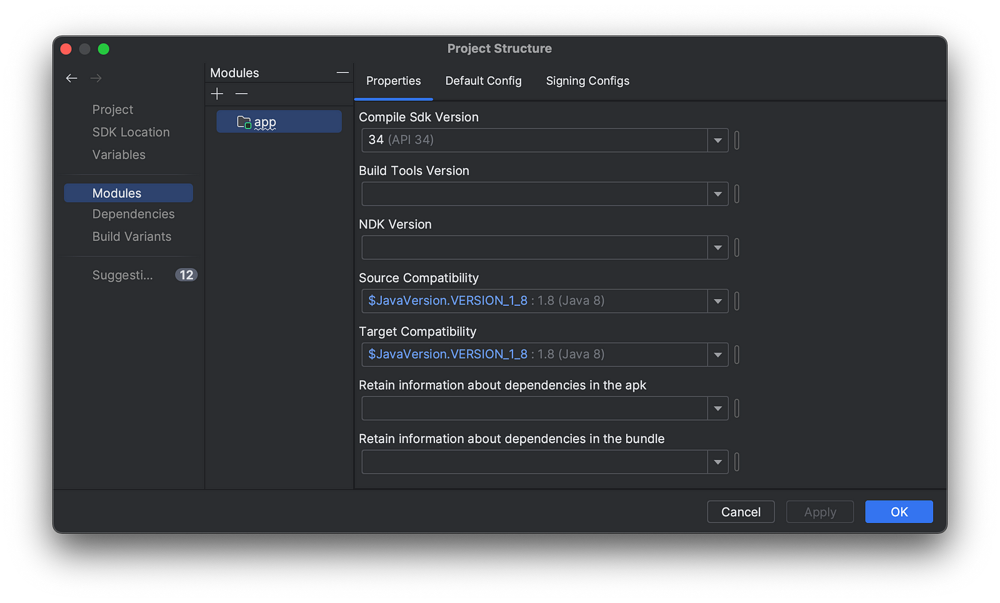
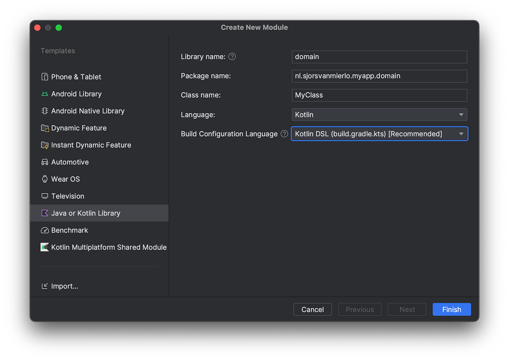

+++
title = 'The advantages of using modules in your Android project'
date = 2024-01-01T20:55:57+02:00
categories = ['Android development']
tags = ['modularization', 'android']
+++ 

---
This article will show you how to add and use multiple modules in your Android project. First, let's explore the benefits of multi-module projects.

# Advantages

## Modularity and maintainability
Creating smaller, specialized modules make your codebase easier to manage and maintain. For example, feature modules are simpler to understand, test, and update.

## Code reusability
Modules promote code reusability by allowing you to encapsulate common functionalities or components. You can reuse these modules in different app sections, saving time and preventing duplicate code.

## Parallel Development
Different teams can work on different parts of the app at the same time with multiple modules. This approach accelerates the development process and allows for quicker iterations.

## Isolation and encapsulation
Using modules enables you to develop en test in isolation. Modules let you build and test code parts separately. This helps you find and fix problems easily without affecting the rest of your app, making it more reliable.

## Dependency Management
Each module can manage its own set of dependencies, reducing conflicts or issues and also enforce rules between modules. This will lead to a more stable and reliable app.

## Reduced build times
Modules can lead to reduced build times, especially during development and testing. This way the developer can work even faster meaning faster iteration cycles and quicker feedback.

## Clearer architecture
Multiple modules help you build apps following clean architecture rules. This creates organized, easy-to-understand code, making it simpler to update and expand the app.

## Team collaboration
Multiple modules allow different teams to independently own and develop specific parts of an app, promoting collaboration and efficiency. This modular approach results in a well-structured, maintainable codebase.

 ---

# Creating a new module
For this post I created a new Android project with Android Studio called 'MyApp'.

## Adding your first module
Open the Project structure via the File menu or use the shortcut:  ⌘+;
Select the Modules option on the left. To create your first module press the + button in the modules column.



## Creating the new module
In this example I will be creating a domain module in preparation for my clean architecture Android project. I will be creating the module using the 'Java or Kotlin Library' template.



## Configuring the dependencies
After creating the new module we need to ensure that the module is added to the project. Check the `settings.gradle.kts` file to make sure the new module is included.

```
include(":app", ":domain")
```
Using the new module in the app module also requires adding the dependency to the `build.gradle.kts` file of the app project.
```
dependencies {
    implementation(project(":domain"))
    // ...
}
```

## Ready to build and run!
You're now ready to build and run the app! You are also able to access the `MyClass.kt` in you `MainActivity.kt` due to the added dependency!
```
package nl.sjorsvanmierlo.myapp

import nl.sjorsvanmierlo.myapp.domain.MyClass
// other imports...

class MainActivity : ComponentActivity() {
    override fun onCreate(savedInstanceState: Bundle?) {
        super.onCreate(savedInstanceState)

        val myClass = MyClass()
        // We are able to use the MyClass from the domain module!
        print(myClass.helloWorld())
    }
}
```

# Conclusion
After following this guide you are now able to set up a multi-module project and benefit of the advantages mentioned above.